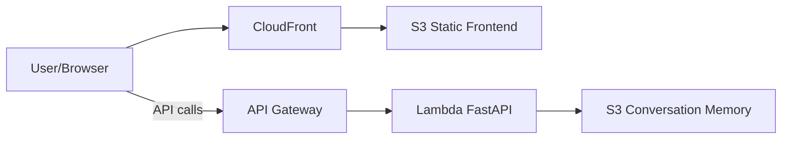

# chatbot_production

A full‑stack, serverless chatbot reference project designed for real-world production. It brings together a FastAPI backend, a Next.js frontend, CI/CD pipelines, and Infrastructure as Code (IaC) on AWS — so you can develop, test, and deploy end‑to‑end with Terraform and GitHub Actions.


## Key Features
- Serverless backend: FastAPI running on AWS Lambda behind API Gateway (auto scale, pay‑per‑use)
- Frontend hosting: Next.js static export to S3, served via CloudFront (fast, secure, low cost)
- Conversation memory: stored in S3 in production and on the local filesystem in development
- IaC with Terraform: S3, CloudFront, API Gateway, Lambda, IAM all declared in code
- CI/CD with GitHub Actions: push to `main` to deploy
- One‑command local dev: run backend and frontend together

## Architecture
- User → CloudFront → S3 (static frontend)
- Frontend → API Gateway → Lambda (FastAPI) → S3 (conversation memory)
- Optional custom domain and CORS settings via Terraform variables



## Tech Stack
- Backend: FastAPI, Uvicorn, Python 3.12
- Frontend: Next.js, React, TailwindCSS, TypeScript
- AI: OpenAI API
- AWS: Lambda, API Gateway, S3, CloudFront, IAM
- DevOps: Terraform, GitHub Actions, Docker (for Lambda packaging)

## Project Structure
- `chatbot_production/backend` — FastAPI app and Lambda packaging script(s)
- `chatbot_production/frontend` — Next.js app (UI components, pages, lib)
- `chatbot_production/scripts` — Local run, deploy, and destroy scripts
- `chatbot_production/terraform` — AWS IaC
- `chatbot_production/.github/workflows` — Deploy/Destroy pipelines

Important files:
- `chatbot_production/backend/server.py` — API: `/chat`, `/sessions`, `/conversation/{id}`, `/health`
- `chatbot_production/frontend/lib/api.ts` — API client using `NEXT_PUBLIC_API_URL`
- `chatbot_production/scripts/run_local.py` — run backend + frontend together locally
- `chatbot_production/scripts/deploy.sh` — Terraform apply + frontend upload to S3/CloudFront
- `chatbot_production/terraform/*.tf` — all AWS resources (S3, CloudFront, API Gateway, Lambda, IAM)

## Local Development
Requirements:
- Python 3.12+, Node.js 20+, npm
- Recommended: `uv` (Python tool) installed
- Set `OPENAI_API_KEY` in your shell environment

Start both services:
```
python chatbot_production/scripts/run_local.py
```
Custom ports:
```
python chatbot_production/scripts/run_local.py --backend-port 8000 --frontend-port 3000
```
Defaults:
- API: `http://localhost:8000`
- Frontend: `http://localhost:3000` (points to API via `NEXT_PUBLIC_API_URL`)

Notes (dev):
- The script sets `USE_S3=false` and stores conversations in `chatbot_production/memory`
- CORS is configured to allow the local frontend origin

## Environment Variables
Runtime (Lambda/Local):
- `OPENAI_API_KEY` — OpenAI API key (do not commit to Git)
- `CORS_ORIGINS` — comma‑separated allowed origins
- `USE_S3` — `true` in production (set by Terraform for Lambda), `false` in dev
- `S3_BUCKET` — memory bucket name (set by Terraform for Lambda)
- `MEMORY_DIR` — local memory directory when `USE_S3=false`

GitHub Actions secrets:
- `AWS_ROLE_ARN`, `AWS_ACCOUNT_ID`, `DEFAULT_AWS_REGION`
- Consider storing `OPENAI_API_KEY` as a secret and configuring it on Lambda after deploy (or extend Terraform to manage it securely)

Production note: Terraform currently sets Lambda env for `CORS_ORIGINS`, `S3_BUCKET`, `USE_S3`. Add `OPENAI_API_KEY` to the Lambda environment after deployment or extend Terraform as per your security policy.

## API Overview
- `GET /health` — health status
- `POST /chat` — body `{ message: string, session_id?: string }` → `{ response, session_id }`
- `GET /sessions` — `{ sessions: Array<{ session_id, last_message, created_at, last_message_timestamp, ... }> }`
- `GET /conversation/{session_id}` — `{ session_id, messages }`

The frontend normalizes API data into `Session` and `Conversation` in `chatbot_production/frontend/lib/api.ts`.

## Deployment
Option 1 — GitHub Actions (recommended)
- Push to `main`
- In GitHub → Actions → “Deploy Chatbot”, choose environment (`dev`/`test`/`prod`)
- The workflow packages Lambda → Terraform apply → builds and uploads the frontend → prints CloudFront/API URLs

Option 2 — Local scripts
Prereqs: AWS CLI, Terraform, Docker, and AWS permissions
```
bash chatbot_production/scripts/deploy.sh dev
# or with project name
bash chatbot_production/scripts/deploy.sh dev myproject
```

Terraform backend (state/lock):
- The script configures Terraform to use S3 for state and DynamoDB for state lock, derived from `PROJECT_NAME` and `AWS_ACCOUNT_ID`
- Ensure these backend resources exist or adapt the script to create them as per your org’s standards

## Destroy
- GitHub Actions: run “Destroy Environment”, choose environment, confirm
- Shell:
```
bash chatbot_production/scripts/destroy.sh dev
```
The script empties relevant S3 buckets and runs `terraform destroy`.

## Customization
- Prompt/behavior: `chatbot_production/backend/context.py`
- UI/logic: `chatbot_production/frontend`
- Infra changes: `chatbot_production/terraform`
- Conversation history ordering (newest first): `chatbot_production/frontend/components/history-sidebar.tsx`

## Security
- Do not commit secrets (e.g., `OPENAI_API_KEY`) to Git. Use GitHub Secrets / AWS SSM Parameter Store / Secrets Manager.
- Restrict CORS to required domains in production.

## Costs
- S3, CloudFront, API Gateway, Lambda, and IAM incur usage‑based costs. Destroy environments when not in use.

---
If you’d like, I can extend Terraform to set `OPENAI_API_KEY` on the Lambda automatically, or add a custom domain toggle and certificate wiring.
